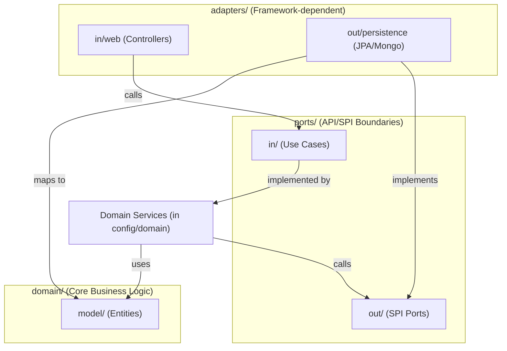

# 01b - Hexagonal Architecture Conventions

> **Author:** Emerson Lima — [github.com/Emersondll](https://github.com/Emersondll)
>
> Mandatory architectural boundaries and refactoring rules for projects using Hexagonal Architecture (Ports and Adapters).
> When applying refactoring or adding features to an existing project identified as Hexagonal, this document overrides the package structures of `01-ARCHITECTURE.md`.

---

## 1. Detection Rules

An existing project is classified as **Hexagonal Architecture** if it satisfies any of these criteria:
* The package structure contains directories named `domain`, `ports`, and `adapters` (or similar terms like `core`, `usecase`, `infrastructure` with strict separation).
* Core business logic classes are decoupled from framework imports (e.g., no `org.springframework` imports inside the domain package).
* Data persistence interfaces are named with suffixes like `Port` or `SPI` rather than `Repository`.

---

## 2. Package & Directory Structure

If hexagonal structure is detected, all new code and modifications MUST follow this layout:

```
com.company.module/
├── domain/                      # PURE DOMAIN (Zero Framework Imports)
│   ├── model/                   # Domain entities and value objects
│   └── exception/               # Domain-specific exceptions (e.g., UserNotFoundException)
├── ports/
│   ├── in/                      # Driving/Incoming Ports (Use Case Interfaces)
│   │   ├── CreateUserUseCase.java
│   │   └── command/             # Immutable commands/queries (Java 26 Records)
│   │       ├── CreateUserCommand.java
│   │       └── UserQueryResult.java
│   └── out/                     # Driven/Outgoing Ports (SPI / Interfaces)
│       └── UserRepositoryPort.java
├── adapters/
│   ├── in/                      # Driving Adapters (REST API, Web, Message Consumers)
│   │   └── web/
│   │       ├── UserController.java
│   │       ├── request/         # Web-specific DTOs (Java 26 Records)
│   │       ├── response/        # Web-specific DTOs (Java 26 Records)
│   │       └── UserWebMapper.java
│   └── out/                     # Driven Adapters (Database, external API clients, SMTP)
│       └── persistence/
│           ├── UserPersistenceAdapter.java
│           ├── UserJpaEntity.java
│           ├── UserJpaRepository.java
│           └── UserPersistenceMapper.java
└── config/                      # Framework Configuration & Bean Wiring
    └── UserModuleConfiguration.java
```

---

## 3. Strict Dependency Flow Rules



### The Rules of Isolation:
1. **Domain Isolation**: Code in `domain/` must be pure Java. It **MUST NOT** import any external framework classes (no Spring, Hibernate, Jackson, etc.).
2. **No DB Annotations in Domain**: Do not use `@Entity`, `@Document`, `@Id`, or `@Column` on domain models.
3. **No DI Stereotypes in Domain**: Do not use `@Service`, `@Component`, `@Autowired`, or `@Inject` in the domain.
4. **Adapter Separation**: Adapters in `adapters/in/` and `adapters/out/` must not reference each other directly. They must interact only through ports.

---

## 4. Code Implementation Examples

### 4.1 Pure Domain Model

```java
package com.company.module.domain.model;

import java.time.Instant;
import java.util.Objects;

/**
 * Pure Domain Model. No JPA/Spring annotations.
 */
public class User {
    private final String id;
    private String name;
    private final String email;
    private Instant createdAt;

    public User(String id, String name, String email, Instant createdAt) {
        this.id = id;
        this.name = Objects.requireNonNull(name);
        this.email = Objects.requireNonNull(email);
        this.createdAt = createdAt;
    }

    public void updateName(String newName) {
        this.name = Objects.requireNonNull(newName);
    }

    // Getters only (Immutability where possible)
    public String getId() { return id; }
    public String getName() { return name; }
    public String getEmail() { return email; }
    public Instant getCreatedAt() { return createdAt; }
}
```

### 4.2 Ports

#### Incoming Port (Use Case)
```java
package com.company.module.ports.in;

import com.company.module.ports.in.command.CreateUserCommand;
import com.company.module.domain.model.User;

public interface CreateUserUseCase {
    User createUser(CreateUserCommand command);
}
```

#### Outgoing Port (SPI)
```java
package com.company.module.ports.out;

import com.company.module.domain.model.User;
import java.util.Optional;

public interface UserRepositoryPort {
    User save(User user);
    Optional<User> findByEmail(String email);
}
```

### 4.3 Driven Persistence Adapter (JPA implementation)

The driven adapter uses database-specific entities (`UserJpaEntity`) and maps them to/from pure domain models (`User`) using a mapper.

```java
package com.company.module.adapters.out.persistence;

import com.company.module.ports.out.UserRepositoryPort;
import com.company.module.domain.model.User;
import org.springframework.stereotype.Component;
import java.util.Optional;

@Component
public class UserPersistenceAdapter implements UserRepositoryPort {

    private final UserJpaRepository jpaRepository;
    private final UserPersistenceMapper mapper;

    public UserPersistenceAdapter(UserJpaRepository jpaRepository, UserPersistenceMapper mapper) {
        this.jpaRepository = jpaRepository;
        this.mapper = mapper;
    }

    @Override
    public User save(User user) {
        UserJpaEntity entity = mapper.toJpaEntity(user);
        UserJpaEntity savedEntity = jpaRepository.save(entity);
        return mapper.toDomain(savedEntity);
    }

    @Override
    public Optional<User> findByEmail(String email) {
        return jpaRepository.findByEmail(email).map(mapper::toDomain);
    }
}
```

> **MongoDB projects:** Replace `UserJpaRepository extends JpaRepository<User, Long>` with
> `UserMongoRepository extends MongoRepository<User, String>` and annotate the persistence entity
> with `@Document` instead of `@Entity`. ID type is `String`, not `Long`.
>
> See also: **18-MONGODB-INDEXES.md** — index conventions for MongoDB entities
> See also: **18b-RELATIONAL-INDEXES-MIGRATIONS.md** — JPA indexes and Flyway migrations

### 4.4 Spring Bean Wiring (Config)

Because domain services do not have Spring annotations (`@Service`), they must be wired as Spring beans explicitly in a configuration class.

```java
package com.company.module.config;

import com.company.module.domain.service.CreateUserService;
import com.company.module.ports.in.CreateUserUseCase;
import com.company.module.ports.out.UserRepositoryPort;
import org.springframework.context.annotation.Bean;
import org.springframework.context.annotation.Configuration;

@Configuration
public class UserModuleConfiguration {

    @Bean
    public CreateUserUseCase createUserUseCase(UserRepositoryPort userRepositoryPort) {
        return new CreateUserService(userRepositoryPort);
    }
}
```

---

## 5. Testing Guidelines in Hexagonal Architecture

### 5.1 Domain Unit Tests
* Pure unit tests using JUnit 5 and Mockito.
* No Spring Boot test context (`@SpringBootTest` is forbidden here).
* Instantiation of services is done manually.

### 5.2 Outbound Adapter Integration Tests
* Test database interactions directly.
* Use `@DataJpaTest` or `@DataMongoTest` alongside Testcontainers.
* Verify mapping correctness between database entities and domain models.

---

## 6. AI Refactoring Checklist for Hexagonal Projects

When modifying or refactoring a hexagonal project:

- [ ] Core domain models contain **ZERO** external library or framework annotations (no Hibernate, Spring annotations). Entity classes in `adapters/out/persistence` follow project Lombok policy (see **02-CODE-QUALITY.md** — Lombok Context-Aware section).
- [ ] Database entities are isolated in `adapters/out/persistence` and NEVER leak into domain services or ports.
- [ ] Inbound request DTOs are mapped to Command records before entering the Use Case.
- [ ] Centralized configuration wiring exists in `config/` (No `@Service` stereotypes on domain services).
- [ ] All package structures are aligned to the `domain`, `ports`, `adapters` layout.
- [ ] No direct imports of controller classes inside persistence adapters or domain services.
