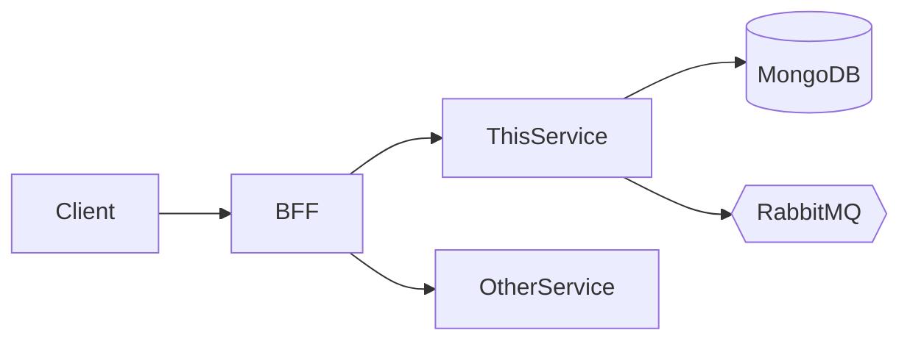

# 22 - Project Documentation Standards

> **Author:** Emerson Lima — [github.com/Emersondll](https://github.com/Emersondll)
>
> Mandatory documentation structure for every Java 26 / Spring Boot microservice.
> This document defines **how project documentation must be organized, generated,
> and maintained** — not the code-level JavaDoc rules (covered by `02-CODE-QUALITY.md`
> and `07-JAVA26-RECORDS-JAVADOC.md`).

---

## 0. Scope & Relationship to Other Specs

This spec is strictly about **project-level documentation artifacts** (README,
architecture diagrams, runbooks, configuration guides). It does **not** redefine
rules already covered by other specs. The table below clarifies boundaries:

| Concern | Authoritative Spec | This Spec's Role |
|---|---|---|
| JavaDoc on classes/methods/records | `02-CODE-QUALITY.md`, `07-JAVA26-RECORDS-JAVADOC.md` | **Does not override** — README links to JavaDoc output |
| API contract (endpoints, schemas, examples) | `13-OPENAPI-REST-REFERENCE.md` | **Does not duplicate** — README references `openapi.yaml` as single source of truth |
| Error envelope format | `15-ERROR-RESPONSE.md` | **Does not duplicate** — troubleshooting links to error spec |
| Observability (logs, metrics, tracing) | `05-OBSERVABILITY.md`, `06b-DOCKER-OPENTELEMETRY-STACK.md` | **Does not duplicate** — observability doc links to these specs |
| Docker & deployment | `06-DOCKER-DEPLOYMENT.md` | **Does not duplicate** — deployment doc links to Docker spec |
| Security (GatewayAuthFilter, IDOR, secrets) | `14-SECURITY.md` | **Does not duplicate** — context doc links to security spec |
| Spring profiles & configuration | `19-SPRING-PROFILES.md` | **Does not duplicate** — configuration doc links to profiles spec |
| RabbitMQ & SAGA events | `16-RABBITMQ-SAGA.md` | **Does not duplicate** — events doc links to SAGA spec |
| Pagination standard | `17-PAGINATION.md` | **Does not duplicate** — README links to pagination spec |
| MongoDB indexes | `18-MONGODB-INDEXES.md` | **Does not duplicate** — architecture doc links to index spec |
| Relational indexes & migrations | `18b-RELATIONAL-INDEXES-MIGRATIONS.md` | **Does not duplicate** — architecture doc links to index spec |
| HTTP idempotency | `21-HTTP-IDEMPOTENCY.md` | **Does not duplicate** — architecture doc links to idempotency spec |
| Git branching & PR workflow | `23-GIT-BRANCHING.md` | **Does not duplicate** — deployment/contributing docs reference branching spec |
| CI/CD, secrets, Vault, Kubernetes, ArgoCD | `24-CICD-SECRETS.md` | **Does not duplicate** — deployment and configuration docs reference this spec |

> **Golden Rule:** Documentation MUST adhere to all existing specs. If a rule is
> defined elsewhere, the documentation references it — never duplicates or
> contradicts it.

---

## 1. Documentation File Structure (MUST)

Every microservice repository MUST contain the following documentation tree:

```
project-root/
├── README.md                                ← Main entry point (high-level)
├── src/main/resources/
│   ├── static/
│   │   └── openapi.yaml                     ← API contract (see 13-OPENAPI)
│   └── docs/
│       ├── README.md                        ← Supplementary docs index
│       ├── architecture.md                  ← Internal architecture details
│       ├── context.md                       ← System context and boundaries
│       ├── configuration.md                 ← Profiles, env vars, feature flags
│       ├── deployment.md                    ← Environments, pipeline, rollback
│       ├── observability.md                 ← Logs, metrics, tracing, dashboards
│       ├── troubleshooting.md               ← Common issues and resolution
│       ├── events.md                        ← Published/consumed async events
│       └── runbooks/
│           ├── README.md                    ← Runbook index
│           └── incident-template.md         ← Incident response template
```

> **Why `src/main/resources/docs/`?** Supplementary documentation stays close to the
> source, is versioned with the code, and is accessible in build artifacts. The
> `README.md` at the project root remains the concise entry point.

---

## 2. `README.md` — Main Entry Point

The root `README.md` MUST be concise, navigable, and structured as follows:

### Required Sections

| Section | Content |
|---|---|
| **Title + Badges** | Service name, build status, coverage badge, Java/Spring versions |
| **Overview** | 2–3 sentences: what the service does and its domain |
| **General Architecture** | High-level Mermaid diagram showing where this service fits in the ecosystem |
| **Tech Stack** | Java 26, Spring Boot 4.0.7, Spring Cloud 2025.1.0, MongoDB, RabbitMQ |
| **API Contract** | Explicit statement: "The OpenAPI specification at `src/main/resources/static/openapi.yaml` is the single source of truth for all endpoints, schemas, and examples. See [Swagger UI](http://localhost:8080/swagger-ui.html) when running locally." |
| **Quick Start** | Prerequisites, clone, build, run (max 5 steps) |
| **Key Configuration** | Table of critical environment variables with references to `19-SPRING-PROFILES.md` |
| **Supplementary Documentation** | Links to every file under `resources/docs/` |
| **Maintainer** | Author name and GitHub link |

### Constraints

- **Max ~200 lines** — keep it scannable; defer details to supplementary docs.
- **No API endpoint duplication** — the README references `openapi.yaml`, never lists endpoints.
- **No code-level JavaDoc** — code documentation is generated from source (see `07-JAVA26-RECORDS-JAVADOC.md`).
- **Mermaid diagrams** — use only where they add clarity (architecture overview, data flow).

### README Template (Skeleton)

```markdown
# {service-name}

> {One-line description of the service and its domain.}


## Overview

{2–3 sentences describing the service purpose, its bounded context, and key capabilities.}

## General Architecture



## Tech Stack

| Technology | Version | Purpose |
|---|---|---|
| Java | 26 | Runtime |
| Spring Boot | 4.0.7 | Framework |
| Spring Cloud | 2025.1.0 | Cloud patterns |
| MongoDB | 7.0 | Database (per-service) |
| RabbitMQ | 3.x | SAGA events |
| Maven | 3.9.9 | Build tool |

## API Contract

The **OpenAPI specification** at `src/main/resources/static/openapi.yaml` is the
**single source of truth** for all endpoints, request/response schemas, and examples.

- Swagger UI: [http://localhost:8080/swagger-ui.html](http://localhost:8080/swagger-ui.html)
- Static file: `src/main/resources/static/openapi.yaml`

> No Swagger annotations exist in code. See `spec/13-OPENAPI-REST-REFERENCE.md`.

## Quick Start

```bash
# Prerequisites: Java 26, Maven 3.9.9, Docker

# MongoDB projects:
docker run -d --rm -p 27017:27017 mongo:7.0

# JPA/PostgreSQL projects:
# docker run -d --rm -p 5432:5432 -e POSTGRES_PASSWORD=dev -e POSTGRES_USER=dev -e POSTGRES_DB=app_dev postgres:16-alpine

mvn clean verify
mvn spring-boot:run -Dspring-boot.run.profiles=dev
# Access: http://localhost:8080/swagger-ui.html
```

## Key Configuration

| Variable | Required | Default (dev) | Description |
|---|---|---|---|
| `GATEWAY_TOKEN` | Yes (prod) | `local-dev-gateway-token` | Internal gateway auth token |
| `MONGODB_URI` | Yes (prod) | `mongodb://localhost:27017/{name}-dev` | MongoDB connection string |
| `RABBITMQ_HOST` | Yes (prod) | `localhost` | RabbitMQ host |

> Full configuration guide: [configuration.md](src/main/resources/docs/configuration.md)
> Profile conventions: `spec/19-SPRING-PROFILES.md`

## Supplementary Documentation

| Document | Description |
|---|---|
| [Docs Index](src/main/resources/docs/README.md) | Index of all supplementary docs |
| [Architecture](src/main/resources/docs/architecture.md) | Internal architecture, flows, integrations |
| [Context](src/main/resources/docs/context.md) | System context, consumers, boundaries |
| [Configuration](src/main/resources/docs/configuration.md) | Profiles, env vars, feature flags |
| [Deployment](src/main/resources/docs/deployment.md) | Environments, pipeline, rollback |
| [Observability](src/main/resources/docs/observability.md) | Logs, metrics, tracing, dashboards |
| [Troubleshooting](src/main/resources/docs/troubleshooting.md) | Common issues and resolution |
| [Events](src/main/resources/docs/events.md) | Published/consumed async events |
| [Runbooks](src/main/resources/docs/runbooks/README.md) | Operational runbooks |

## Maintainer

| Name | GitHub |
|---|---|
| **Emerson Lima** | [github.com/Emersondll](https://github.com/Emersondll) |
```

---

## 3. Supplementary Documents — Content Guide

### 3.1 `resources/docs/README.md` — Docs Index

A simple index linking to all supplementary documents with a one-line description
of each. No content duplication.

### 3.2 `resources/docs/architecture.md`

- Internal layered architecture: Controller → Service → Repository → Database
- Component diagram (Mermaid) showing internal packages
- Key design decisions (ADRs summary)
- Integration points with other microservices
- Data flow diagrams for critical operations

> **Cross-reference only:** Link to `spec/01-ARCHITECTURE.md` or `spec/01b-HEXAGONAL-ARCHITECTURE.md` for coding patterns and architectural structures.
> Link to `spec/18-MONGODB-INDEXES.md` or `spec/18b-RELATIONAL-INDEXES-MIGRATIONS.md` for index/migration conventions.
> Link to `spec/21-HTTP-IDEMPOTENCY.md` for idempotency patterns.

### 3.3 `resources/docs/context.md`

- System context diagram (Mermaid C4 Level 1)
- Upstream consumers (which services/clients call this service)
- Downstream dependencies (which services/databases this service calls)
- Trust boundary and security model reference (link to `spec/14-SECURITY.md`)
- Service boundaries and domain scope

### 3.4 `resources/docs/configuration.md`

- Full table of environment variables with types, defaults, and descriptions
- Spring profile conventions reference (link to `spec/19-SPRING-PROFILES.md`)
- Feature flags (if applicable)
- Secrets management reference (link to `spec/14-SECURITY.md` §7 for trust boundary + `spec/24-CICD-SECRETS.md` for .env, Vault, Kubernetes Secrets, ArgoCD)

> **No hardcoded credentials.** Use `${VAR}` placeholders with descriptions.

### 3.5 `resources/docs/deployment.md`

- Environment overview (dev, test, staging, prod)
- Docker build and run instructions reference (link to `spec/06-DOCKER-DEPLOYMENT.md`)
- CI/CD pipeline overview (link to `spec/24-CICD-SECRETS.md` — GitHub Actions, Docker build and push, ArgoCD GitOps)
- Rollback procedures
- Health check endpoints: `/actuator/health/liveness`, `/actuator/health/readiness`

### 3.6 `resources/docs/observability.md`

- Logging strategy summary and reference (link to `spec/05-OBSERVABILITY.md`)
- Key metrics exposed and their Prometheus queries
- Distributed tracing configuration reference (link to `spec/06b-DOCKER-OPENTELEMETRY-STACK.md`)
- Grafana dashboard links/descriptions
- Alert rules summary

> **No duplication of logging configuration.** Reference the authoritative spec.

### 3.7 `resources/docs/troubleshooting.md`

- Common issues table: symptom → cause → resolution
- Error codes reference (link to `spec/15-ERROR-RESPONSE.md`)
- Circuit breaker states and recovery (link to `spec/10-CIRCUIT-BREAKER.md`)
- Database connectivity issues
- RabbitMQ consumer issues (link to `spec/16-RABBITMQ-SAGA.md`)

### 3.8 `resources/docs/events.md`

- Published events: event type, exchange, routing key, payload schema
- Consumed events: event type, queue, expected payload, processing logic
- SAGA flow diagram (Mermaid) reference (link to `spec/16-RABBITMQ-SAGA.md`)
- DLQ handling procedures

### 3.9 `resources/docs/runbooks/`

- `README.md` — index of operational runbooks
- `incident-template.md` — standard incident response template with sections:
  - Incident title, severity, date/time
  - Impact assessment
  - Root cause analysis
  - Resolution steps
  - Follow-up actions

---

## 4. AI Usage Guidelines (MUST)

When an AI generates or updates documentation for a microservice, it MUST follow
these rules:

### 4.1 Pre-Generation Checklist

Before generating any documentation, the AI MUST:

1. **Read all `/spec` files** — understand all established rules, patterns, and
   conventions before writing a single line.
2. **Read existing code** — understand the actual implementation, endpoints,
   configurations, and dependencies.
3. **Identify the service name and domain** — use accurate naming throughout.
4. **Check for existing documentation** — update rather than overwrite; preserve
   any manually written content that is still accurate.

### 4.2 Content Rules

| Rule | Description |
|---|---|
| **Language** | All documentation MUST be written in English |
| **Accuracy** | Only document what exists in the codebase — never invent endpoints, integrations, variables, or business rules |
| **Placeholders** | If information is unknown, use clear placeholders: `{TODO: description of missing data}` — never fabricate specifics |
| **No duplication** | Never copy content from `openapi.yaml`, other spec files, or code-level JavaDoc into documentation — always reference the authoritative source |
| **No contradiction** | Documentation MUST NOT contradict any rule in the `/spec` folder — if in doubt, defer to the spec |
| **Clean Markdown** | Professional, corporate tone — no emoji in headings, no casual language, no marketing fluff |
| **Diagrams** | Use Mermaid only where it adds structural clarity (architecture, data flow, SAGA) — not for trivial illustrations |
| **Links** | Use relative links within the repository; absolute links only for external resources |

### 4.3 Generation Workflow

When generating documentation for a microservice, the AI MUST follow this order:

```
1. Read /spec folder          → Capture all rules and conventions
2. Read source code           → Understand actual implementation
3. Read existing docs         → Identify what needs update vs creation
4. Generate docs/README.md    → Create the supplementary docs index
5. Generate README.md         → Create the root-level entry point
6. Generate architecture.md   → Document internal structure
7. Generate context.md        → Document system boundaries
8. Generate configuration.md  → Document all env vars and profiles
9. Generate deployment.md     → Document Docker, CI/CD, rollback
10. Generate observability.md → Document logs, metrics, tracing
11. Generate events.md        → Document published/consumed events
12. Generate troubleshooting.md → Document common issues
13. Generate runbooks/         → Create incident templates
14. Validate cross-references  → Ensure all links resolve
15. Verify no spec violations  → Final compliance check
```

### 4.4 Validation Checklist for AI

After generating documentation, the AI MUST verify:

- [ ] `README.md` does not list API endpoints (references `openapi.yaml` instead)
- [ ] `README.md` includes a "General Architecture" section with Mermaid diagram
- [ ] `README.md` includes an "API Contract" section pointing to `openapi.yaml`
- [ ] No content from `openapi.yaml` is duplicated in any documentation file
- [ ] No content from `/spec` files is duplicated — only referenced via links
- [ ] No Swagger annotations are mentioned as valid (`@Tag`, `@Operation`, etc.)
- [ ] Configuration section references `spec/19-SPRING-PROFILES.md`
- [ ] Security section references `spec/14-SECURITY.md`
- [ ] Observability section references `spec/05-OBSERVABILITY.md`
- [ ] Events section references `spec/16-RABBITMQ-SAGA.md`
- [ ] Error handling section references `spec/15-ERROR-RESPONSE.md`
- [ ] All Mermaid diagrams render correctly
- [ ] All internal links resolve to existing files
- [ ] No fabricated data (endpoints, variables, integrations)
- [ ] All documentation is in English
- [ ] `README.md` is ≤ 200 lines
- [ ] Markdown is clean, professional, and well-structured

### 4.5 Prohibited Actions

The AI MUST NOT:

- Invent endpoints, integrations, variables, or business rules not present in the codebase
- Duplicate the OpenAPI contract in README or any other doc
- Use annotations forbidden by `13-OPENAPI-REST-REFERENCE.md` in examples
- Include stack traces, internal class names, or sensitive data in documentation
- Generate documentation in any language other than English
- Create excessively long documents — keep each file focused and < 300 lines
- Use `LocalDateTime` in examples — always use `Instant` (per `02-CODE-QUALITY.md`)
- Use `Long` for MongoDB entity IDs — MongoDB uses `String`; JPA/Relational projects use `Long` (per `02-CODE-QUALITY.md` and `spec/18b-RELATIONAL-INDEXES-MIGRATIONS.md`)
- Reference `@Autowired` field injection in examples — always constructor injection
- Reference `application.properties` — only `application.yml` is allowed

---

## 5. README vs. OpenAPI — Boundary Rule (MUST)

| Information | Where It Lives | README Action |
|---|---|---|
| Endpoint paths, methods | `openapi.yaml` | Reference only: "See openapi.yaml" |
| Request/response schemas | `openapi.yaml` | Reference only |
| Request/response examples | `openapi.yaml` | Reference only |
| Error codes and envelopes | `openapi.yaml` + `15-ERROR-RESPONSE.md` | Reference only |
| Service overview and purpose | `README.md` | **Define here** |
| Architecture position | `README.md` + `architecture.md` | **Define here** |
| Quick start instructions | `README.md` | **Define here** |
| Configuration guide | `configuration.md` | **Define here**, README links to it |

> **Rationale:** The OpenAPI file is the single source of truth for the API contract.
> Duplicating it in the README creates maintenance burden and inevitable drift.
> This aligns with `13-OPENAPI-REST-REFERENCE.md` which mandates a static
> `openapi.yaml` and forbids Swagger annotations in code.

---

## 6. Documentation Maintenance

- Documentation MUST be updated when code changes affect:
  - Public API (update `openapi.yaml` — per `13-OPENAPI-REST-REFERENCE.md`)
  - Configuration (update `configuration.md`)
  - Architecture (update `architecture.md`)
  - Events (update `events.md`)
  - Deployment (update `deployment.md`)
- Stale documentation is a defect — treat it with the same urgency as a bug.
- All documentation changes follow Conventional Commits: `docs: update architecture diagram`

---

## 7. Per-Service Checklist

- [ ] `README.md` at project root with all required sections
- [ ] `README.md` ≤ 200 lines, scannable, with links to supplementary docs
- [ ] `README.md` does not duplicate OpenAPI content
- [ ] `README.md` includes "General Architecture" Mermaid diagram
- [ ] `README.md` includes "API Contract" section referencing `openapi.yaml`
- [ ] `src/main/resources/docs/README.md` — supplementary docs index
- [ ] `src/main/resources/docs/architecture.md` — internal architecture
- [ ] `src/main/resources/docs/context.md` — system context and boundaries
- [ ] `src/main/resources/docs/configuration.md` — full env var reference
- [ ] `src/main/resources/docs/deployment.md` — Docker, CI/CD, rollback
- [ ] `src/main/resources/docs/observability.md` — logs, metrics, tracing
- [ ] `src/main/resources/docs/troubleshooting.md` — common issues
- [ ] `src/main/resources/docs/events.md` — async events published/consumed
- [ ] `src/main/resources/docs/runbooks/README.md` — runbook index
- [ ] `src/main/resources/docs/runbooks/incident-template.md` — incident template
- [ ] `openapi.yaml` at `src/main/resources/static/openapi.yaml`
- [ ] All documentation in English
- [ ] No fabricated data or placeholder endpoints
- [ ] All cross-references and links valid
- [ ] `mvn verify` still green (documentation changes did not break build)

---

*Maintained by [Emerson Lima](https://github.com/Emersondll)*
